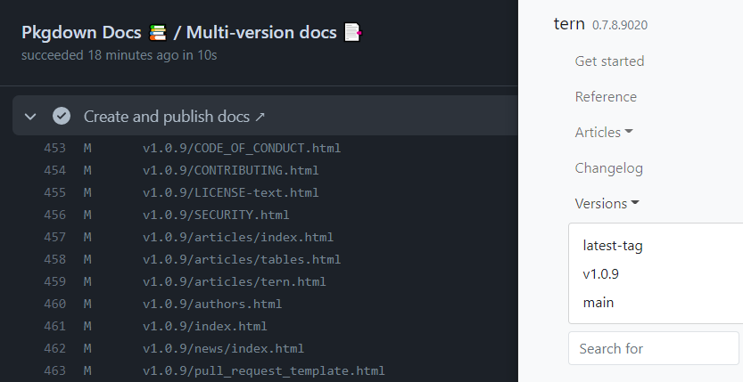

<!-- BEGIN_ACTION_DOC -->
# R pkgdown Multi Version docs

Github Action to generate multiple versions of [`pkgdown`](https://pkgdown.r-lib.org/) docs for R packages.

This Github Actions works under the following assumptions:

* R package documentation is generated by the R function [`pkgdown::build_site`](https://pkgdown.r-lib.org/reference/build_site.html)
* Documentation is published to the `gh-pages` branch of the package repository and Github Pages is enabled at the root level of the branch
* The version of `pkgdown` used to generate the documentation is `>= v2.0.0`
* The `pkgdown` documentation uses Bootstrap 5
* The `URL` field in the package DESCRIPTION file contains a reference to the pkgdown site URL (see step 1 [here](https://pkgdown.r-lib.org/articles/pkgdown.html#promoting))

An example of the output of the action can be seen below:

### Description
Generates multisite R documentation created with pkgdown.
### Action Type
Composite

### Author
Insights Engineering

### Inputs
* `path`:

  _Description_: Path to package's root

  _Required_: `false`

  _Default_: `.`

* `default-landing-page`:

  _Description_: The default branch or tag on gh-pages that corresponds to the landing page.
For instance, if your root index page on gh-pages is built using the 'main'
branch, then the root page of the website will correspond to this page.
If 'latest-tag' is selected, then the latest version will become the default.

  _Required_: `false`

  _Default_: `main`

* `branches-or-tags-to-list`:

  _Description_: Which branches or tags should be listed under the 'Versions' dropdown menu on the landing page? This input should be a regular expression in R.

  _Required_: `false`

  _Default_: `^main$|^devel$|^pre-release$|^latest-tag$|^release-candidate$|^develop$|^v([0-9]+\.)?([0-9]+\.)?([0-9]+)|^v([0-9]+\.)?([0-9]+\.)?([0-9]+)(-rc[0-9]+)$`

* `refs-order`:

  _Description_: The order in which refs should appear in the drop-down list. Versions not in the vector
will appear below refs listed here.
If docs have never been generated for the ref, the ref will not appear in the
drop-down. Similarly, if docs have been generated for the ref, but the ref is not
listed in the vector, it will not appear in the drop-down.
Example (the refs on the list should be separated by space):
main devel pre-release latest-tag

  _Required_: `false`

  _Default_: `main devel pre-release latest-tag`

* `latest-tag-alt-name`:

  _Description_: An alternate name for the 'latest-tag' item

  _Required_: `false`

  _Default_: `""`

* `release-candidate-alt-name`:

  _Description_: An alternate name for the 'release-candidate' item

  _Required_: `false`

  _Default_: `""`

### Outputs
None
<!-- END_ACTION_DOC -->
